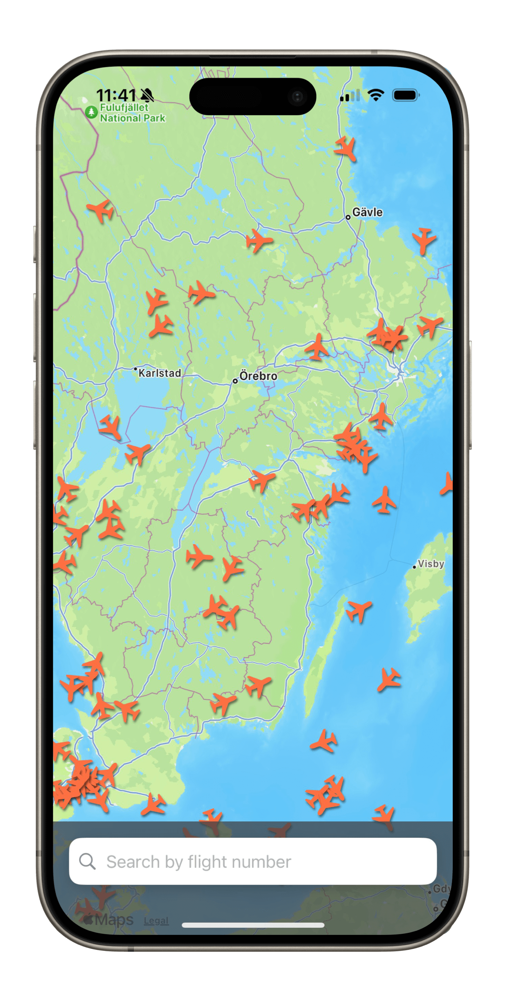
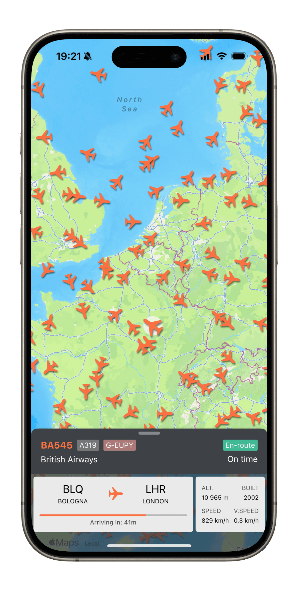
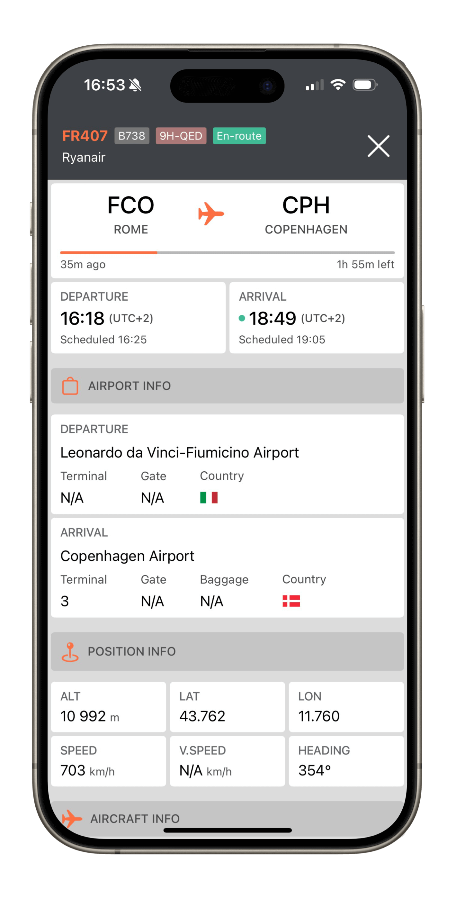
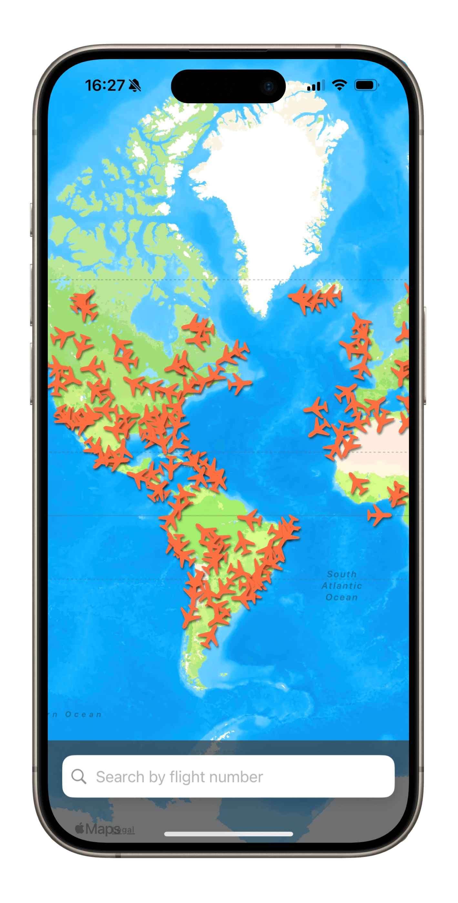

# Flight Tracker

Track flights in real-time. Search for flights using a flight number or interact with the map to discover active flights.

This iOS app was developed as part of the course "HI1033 Mobile Applications and Wireless Networks" at KTH Royal Institute of Technology.

## Screenshots

<p align="left">
  
  
  
  
</p>

## Tech Stack

- **Architecture:** MVVM (Model-View-ViewModel)
- **UI Framework:** SwiftUI
- **Map Interaction:** MapKit
- **Flight Data:** AirLabs API

## Setup

To set up the project on your local machine:

1. Clone the repository to your local machine.
2. In the project directory, navigate to the `model` folder.
3. Create a file named `Config.swift` with the following content:

```swift
struct Config {
    static let apiKey = "YOUR_AIRLABS_API_KEY"
}
```
